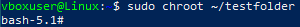
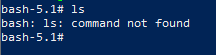
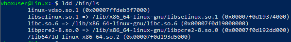
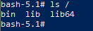
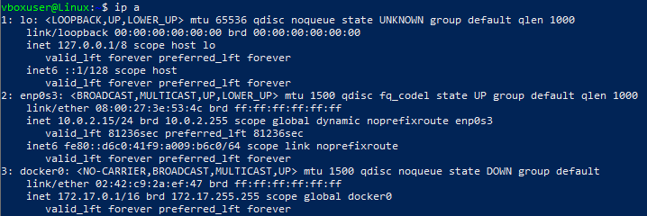
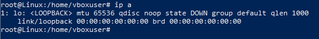
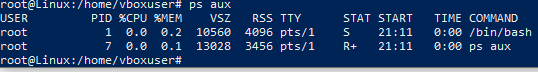

## Задание: необходимо продемонстрировать изоляцию одного и того же приложения (как решено на семинаре - командного интерпретатора) в различных пространствах имен.

### Запуск Bash в новом пространстве имен

Создадим папку testfolder в и скопируем необходимые исполняемые файлы и библиотеки в эту папку:

mkdir ~/testfolder

mkdir ~/testfolder/bin

cp /bin/bash ~/testfolder/bin

mkdir ~/testfolder/lib ~/testfolder/lib64

cp /lib/x86_64-linux-gnu/libtinfo.so.6 ~/testfolder/lib

cp /lib/x86_64-linux-gnu/libc.so.6 ~/testfolder/lib

cp /lib64/ld-linux-x86-64.so.2 ~/testfolder/lib64/

Запустим команду chroot. Мы должны увидеть изменение приветствия оболочки, что означает успешное выполнение команды chroot.

sudo chroot ~/testfolder

Запустим команду ls

Получаем ошибку, так как нет исполняемого файла "ls", и связанных с ним библиотек в созданном каталоге

Выходим из созданной оболочки и ищем необходимые библиотеки для выполнения команды "ls"

exit

lld /bin/ls

Копируем необходимые библиотеки

cp /bin/ls ~/testfolder/bin/

cp /lib/x86_64-linux-gnu/libselinux.so.1 ~/testfolder/lib/

cp /lib/x86_64-linux-gnu/libpcre2-8.so.0 ~/testfolder/lib/

Снова входим в изолированную среду через chroot

sudo chroot ~/testfolder

Запускаем ls корневой папки

ls /

Команда выполнилась

Пространство имен:

Однако стоит отметить, что использование chroot имеет недостатки, такие как необходимость дублирования всех необходимых файлов. 

Вместо этого, можно рассмотреть использование механизма пространства имен.

Пространство имен в Linux обеспечивает изоляцию процессов друг от друга, и может быть более эффективным способом управления изоляцией и ресурсами.

Вышеупомянутые инструменты, такие как Docker, также предоставляют более надежные и гибкие средства для изоляции процессов и управления ресурсами.

## Создание Пространства Имен для Сети

Посмотрим сетевое окружение

ip a

Создадим пространство имен с именем "testns"

sudo ip netns add testns

Войдем в изолированную оболочку

sudo ip netns exec testns bash

Посмотрим сетевое окружение в этой оболочке

Внутри изолированной среды мы можем увидеть только виртуальные настройки, поскольку в этой среде нет реальных сетевых ресурсов.

ip a

Выполнив команду ps aux, мы можем увидеть список всех процессов в текущем пространстве имен. 

Однако они будут ограничены только к процессам, которые работают в данной изолированной области.

ps aux

## Более Глубокая Изоляция

Изоляция по Процессам и Файловой Системе

unshare --net --pid --fork --mount-proc /bin/bash

ps aux

unshare Утилита которая позволяет это разграничивать -

--net — ограничевает сетевое пространство имен ip a

-mount-proc — разграничивает процессы ps aux

--fork — изолирует память

--pid — изолирует дерево процессов

Формально мы внутри контейнера
ls
ls /
ps aux

Подготовил студент Geek Brains Сурков Иван. Контейнеризация. Урок 1. Механизмы пространства имен

